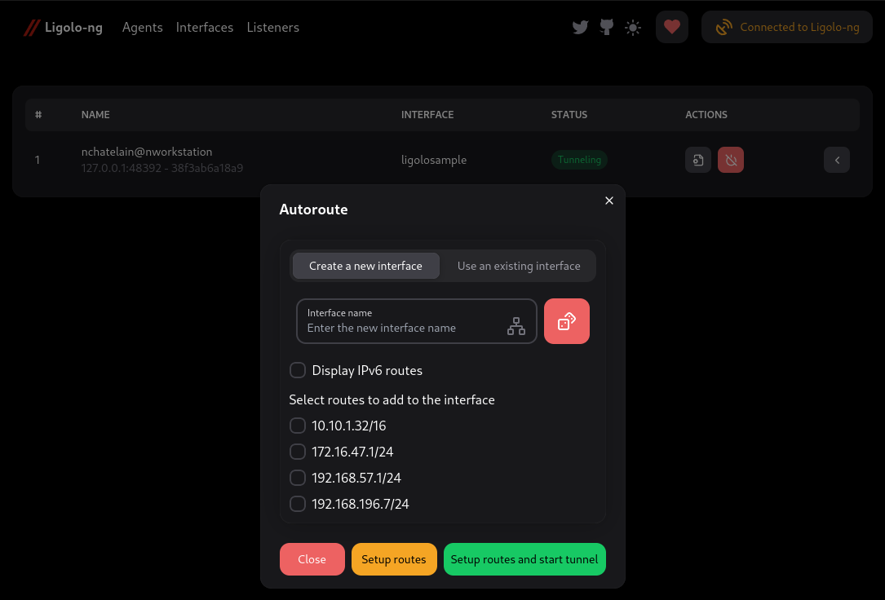

# Ligolo-ng Relay : Tunneling like a VPN


An advanced, yet simple, tunneling tool that uses TUN interfaces — extended for
**multi-hop pivoting** through deeply segmented networks.

[](https://www.gnu.org/licenses/gpl-3.0)

> **Ligolo-ng Relay is a maintained fork of
> [upstream Ligolo-ng](https://github.com/nicocha30/ligolo-ng).** It adds recursive relay
> chains, so an agent can act as a lightweight TLS relay for downstream agents
> that cannot reach the proxy directly, plus ICMP Port Unreachable responses that
> make UDP scans return instantly instead of timing out. See
> **[ENHANCEMENTS.md](ENHANCEMENTS.md)** for details and usage.
> The exact fork delta is tracked in **[FORK-DELTA.md](FORK-DELTA.md)**, and the
> relay path can be verified with `make relay-test`.
>
> Setup, quickstart, and core usage are unchanged from upstream — the upstream
> [upstream Ligolo-ng Documentation](https://docs.ligolo.ng/) still applies.

> [!TIP]
> Upstream Ligolo-ng 0.8 added a lot of new features, including:
> - 🌐 API and a beautiful Web Interface thanks to [L'ami du Raisin](https://github.com/jeremiebedjai), allowing **multiplayer**!
> - ⚙️ Simple configuration file, to keep your tunneling/proxy settings
> - 🚦 **Daemon mode**, to run upstream Ligolo-ng as a service
> - 🔗 Auto-bind, to **automatically configure tunneling** whenever a specific agent connects
> - 📶 Easy and automatic (autoroute) route and interface management on **Windows, Linux, MacOS and BSD**!
> - 💀 Agent kill, to remotely terminate an agent
>
> Please try it out! 
> [Release: upstream Ligolo-ng 0.8](https://github.com/nicocha30/ligolo-ng/releases/tag/v0.8)
> 
> 

## Table of Contents

<!-- START doctoc generated TOC please keep comment here to allow auto update -->
<!-- DON'T EDIT THIS SECTION, INSTEAD RE-RUN doctoc TO UPDATE -->

- [Introduction](#introduction)
- [Features](#features)
- [Demo](#demo)
- [How is this different from Ligolo/Chisel/Meterpreter... ?](#how-is-this-different-from-ligolochiselmeterpreter-)
- [How to use - documentation - tutorial](#how-to-use---documentation---tutorial)
- [Does it require Administrator/root access ?](#does-it-require-administratorroot-access-)
- [Supported protocols/packets](#supported-protocolspackets)
- [Performance](#performance)
- [Caveats](#caveats)
- [Todo](#todo)
- [Credits](#credits)

<!-- END doctoc generated TOC please keep comment here to allow auto update -->

## Introduction

**Ligolo-ng Relay** keeps upstream Ligolo-ng's simple, lightweight TUN-based tunneling
model and adds recursive relay chains for multi-pivot operator workflows.

## Features

- **Tun interface** (No more SOCKS/Proxychains!)
- Simple UI with *agent* selection and *network information*
- Easy to use and setup
- Automatic certificate configuration with Let's Encrypt
- Performant (Multiplexing)
- Does not require privileges on the *agent*
- Socket listening/binding on the *agent*
- Multiple platforms supported for the *agent*
- Can handle multiple tunnels
- Reverse/Bind Connection
- Automatic tunnel/listeners recovery (in case of network issues)
- Websocket support
- **Multi-hop agent chaining (relay mode)** for pivoting through segmented networks (see [ENHANCEMENTS.md](ENHANCEMENTS.md))
- **Relay operations dashboard and `relayctl ops`** for chain health, route
  conflicts, token state, and automation gates
- **Smart relay automation** for route planning, safe repair actions, parent
  failover, and opt-in bounded auto-heal reconciliation
- **MCP server (`relaymcp`)** exposing the relay control plane to AI agents such
  as Claude over stdio or streamable HTTP (see [doc/MCP.md](doc/MCP.md))
- **ICMP Port Unreachable** responses for fast UDP port scanning

## Fork verification

- `make relay-test` runs a Docker lab with a proxy, a direct relay agent, a
  nested relay agent, and a downstream agent connected through the relay chain,
  including auto-heal failover preview and apply.
- [doc/QUICKSTART_RELAY.md](doc/QUICKSTART_RELAY.md) gives the copy-paste
  operator path for `Proxy -> Agent A relay -> Agent B`, including `relayctl
  doctor`, token rotation, and revocation.
- [doc/RELAY_API.md](doc/RELAY_API.md) documents scriptable relay control and
  structured chain status, including the `relayctl` helper.
- [doc/MCP.md](doc/MCP.md) documents the `relaymcp` MCP server that lets an AI
  agent (e.g. Claude) drive the same relay control plane through MCP tools.
- `chain_routes`, `chain_plan`, `chain_repair`, `chain_failover`,
  `chain_autoroute`, `relayctl chain-plan`, `relayctl chain-repair`,
  `relayctl chain-failover`, `relayctl autoheal`, and
  `relayctl ops --fail-on-warning` help preview, repair, re-parent, reconcile,
  apply, and gate per-agent routes across direct and relayed sessions.
- The Web UI **Relay** page exposes the same relay operations report with
  topology, mesh health, smart route-plan decisions, repair and failover
  recommendations, suggested actions, auto-heal status, relay start, and token
  controls.
- [doc/DEPLOYMENT.md](doc/DEPLOYMENT.md) covers Docker Compose, systemd, and
  Helm deployment patterns for production hosts.
- [doc/UDP_SCAN_BENCHMARK.md](doc/UDP_SCAN_BENCHMARK.md) describes how to measure
  UDP scan speed and classification accuracy.
- [doc/RESTRICTIVE_EGRESS.md](doc/RESTRICTIVE_EGRESS.md) covers WebSocket, HTTP
  proxy, SOCKS, and relay-chain usage in constrained networks.
- [doc/PERFORMANCE.md](doc/PERFORMANCE.md) gives repeatable path RTT and
  throughput checks for relay chains.
- [doc/RELEASE.md](doc/RELEASE.md) documents release gates and artifact signing.
- `build/verify-release.sh` verifies release archives, checksum Sigstore
  bundles, and GHCR image signatures for a downloaded release.

## Demo

[Ligolo-ng-demo.webm](https://github.com/nicocha30/ligolo-ng/assets/31402213/3070bb7c-0b0d-4c77-9181-cff74fb2f0ba)

## How is this different from Ligolo/Chisel/Meterpreter... ?

Like upstream Ligolo-ng, **Ligolo-ng Relay** creates a userland network stack
using [Gvisor](https://gvisor.dev/) instead of requiring SOCKS proxychains or
manual TCP/UDP forwarders.

When running the *relay/proxy* server, a **tun** interface is used, packets sent to this interface are
translated, and then transmitted to the *agent* remote network.

As an example, for a TCP connection:

- SYN are translated to connect() on remote
- SYN-ACK is sent back if connect() succeed
- RST is sent if ECONNRESET, ECONNABORTED or ECONNREFUSED syscall are returned after connect
- Nothing is sent if timeout

This allows running tools like *nmap* without the use of *proxychains* (simpler and faster).

## How to use - documentation - tutorial

Core setup and usage are inherited from upstream Ligolo-ng and remain documented in the
[upstream Ligolo-ng Documentation](https://docs.ligolo.ng/). Fork-specific relay-chain
usage lives in [ENHANCEMENTS.md](ENHANCEMENTS.md),
[doc/QUICKSTART_RELAY.md](doc/QUICKSTART_RELAY.md),
[doc/RELAY_API.md](doc/RELAY_API.md), and [doc/MCP.md](doc/MCP.md).

## AI agent control (MCP)

Ligolo-ng Relay can be driven by an AI agent (such as Claude) through the
[Model Context Protocol](https://modelcontextprotocol.io). Run it as the standalone
`relaymcp` bridge against the API, or embed it directly in the proxy:

```shell
# standalone bridge (talks to the proxy REST API)
LIGOLO_API=http://127.0.0.1:8080 LIGOLO_USER=relay LIGOLO_PASSWORD=… relaymcp

# embedded in the proxy, over stdio (no API server needed)
proxy -mcp -selfcert -laddr 0.0.0.0:11601

# embedded, over streamable HTTP at /mcp (behind the API's JWT auth)
proxy -api -mcp-api -web-user relay -web-password …
```

Tools cover agents, relay chains, diagnostics, route planning, repair, parent
failover, auto-heal, tunnels, listeners, interfaces, and routes, with MCP destructive
hints so the client confirms disruptive actions (or run read-only). See
[doc/MCP.md](doc/MCP.md) for the tool catalog and client configuration.

## Does it require Administrator/root access ?

On the *agent* side, no! Everything can be performed without administrative access.

However, on your *relay/proxy* server, you need to be able to create a *tun* interface.

## Supported protocols/packets

* TCP
* UDP
* ICMP (echo requests, and Port Unreachable errors for UDP scan acceleration)

## Performance

You can easily hit more than 100 Mbits/sec. Here is a test using `iperf` from a 200Mbits/s server to a 200Mbits/s connection.
```shell
$ iperf3 -c 10.10.0.1 -p 24483
Connecting to host 10.10.0.1, port 24483
[  5] local 10.10.0.224 port 50654 connected to 10.10.0.1 port 24483
[ ID] Interval           Transfer     Bitrate         Retr  Cwnd
[  5]   0.00-1.00   sec  12.5 MBytes   105 Mbits/sec    0    164 KBytes       
[  5]   1.00-2.00   sec  12.7 MBytes   107 Mbits/sec    0    263 KBytes       
[  5]   2.00-3.00   sec  12.4 MBytes   104 Mbits/sec    0    263 KBytes       
[  5]   3.00-4.00   sec  12.7 MBytes   106 Mbits/sec    0    263 KBytes       
[  5]   4.00-5.00   sec  13.1 MBytes   110 Mbits/sec    2    134 KBytes       
[  5]   5.00-6.00   sec  13.4 MBytes   113 Mbits/sec    0    147 KBytes       
[  5]   6.00-7.00   sec  12.6 MBytes   105 Mbits/sec    0    158 KBytes       
[  5]   7.00-8.00   sec  12.1 MBytes   101 Mbits/sec    0    173 KBytes       
[  5]   8.00-9.00   sec  12.7 MBytes   106 Mbits/sec    0    182 KBytes       
[  5]   9.00-10.00  sec  12.6 MBytes   106 Mbits/sec    0    188 KBytes       
- - - - - - - - - - - - - - - - - - - - - - - - -
[ ID] Interval           Transfer     Bitrate         Retr
[  5]   0.00-10.00  sec   127 MBytes   106 Mbits/sec    2             sender
[  5]   0.00-10.08  sec   125 MBytes   104 Mbits/sec                  receiver
```

## Caveats

Because the *agent* is running without privileges, it's not possible to forward raw packets.
When you perform a NMAP SYN-SCAN, a TCP connect() is performed on the agent.

When using *nmap*, you should use `--unprivileged` or `-PE` to avoid false positives.

## Todo

- ~~Implement other ICMP error messages (this will speed up UDP scans)~~ (done — ICMP Port Unreachable) ;
- ~~Multi-hop agent chaining~~ (done — relay mode) ;
- Do not *RST* when receiving an *ACK* from an invalid TCP connection (nmap will report the host as up) ;
- Add mTLS support.

## Credits

Ligolo-ng Relay is a maintained fork of
[upstream Ligolo-ng](https://github.com/nicocha30/ligolo-ng) by Nicolas Chatelain. All
credit for the original tool goes to the upstream authors:

- Nicolas Chatelain <nicolas -at- chatelain.me>
- Jeremie Bedjai (Ligolo-ng-Web)
